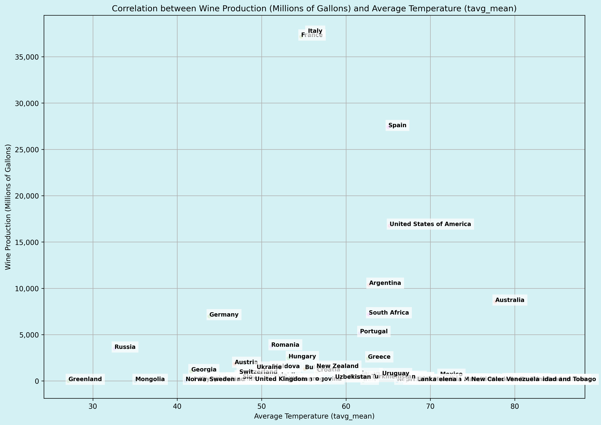
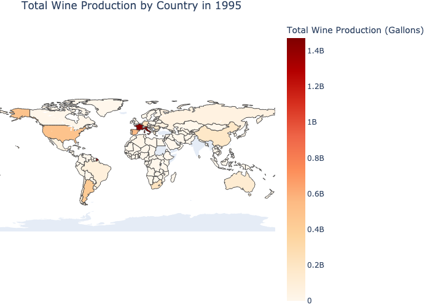
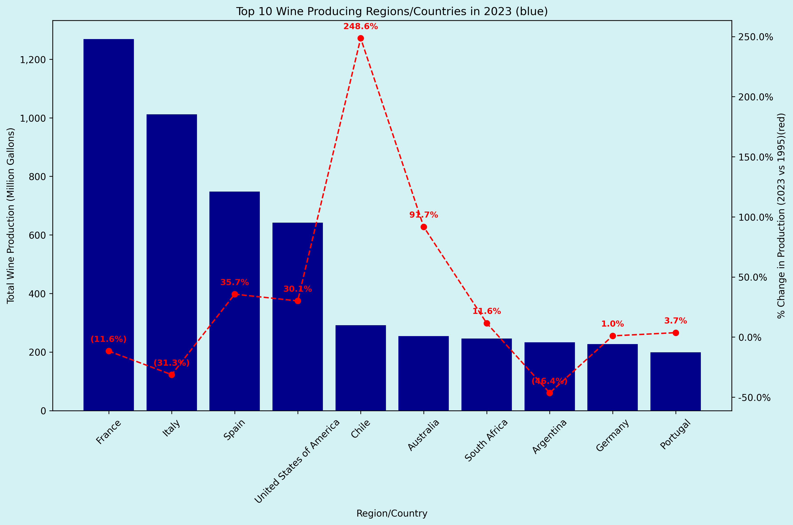

# Wine Production and Climate Analysis Project

---

**Project Title:**  
**Analysis of Climate Change Impacts on Global Wine Production (1995-2023)**  

**Contributors:**  
- Theresa Fregoso  
- Jeff Kim  
- Brenda McCourt  
- Madison Outland  
- Rinal Shastri  

---

## Overview

This project explores the correlation between climate variables (such as temperature and precipitation) and global wine production. By leveraging data from various sources, including the NOAA Climate Data and the International Organization of Vine and Wine, this analysis investigates how climate has influenced wine production from 1995 to 2023.

## Hypotheses

- **Main Hypothesis:** There is a correlation between weather conditions and wine production.
- **Null Hypothesis:** There is no measurable correlation.

## Research Questions

1. Which were the top wine-producing countries in 1995?
2. What are the top wine-producing countries in 2023?
3. What is the correlation between temperature and wine production?
4. What is the correlation between precipitation and wine production?
5. What are the optimal temperature and precipitation levels for maximum wine production?
6. How have changes in climate impacted wine production in different countries?

# Wine Production and Climate Analysis Project

## Visualizations

Here is a scatter plot showing the correlation between wine production and average temperature.

This plot shows the wine production in 1995

Top producing countries in 2023, the red line is the amount their production increased since 1995

## Data Sources

- **Wine Production Data:**
  - International Organization of Vine and Wine ([link](https://www.oiv.int/what-we-do/statistics))
  
- **Climate Data:**
  - NOAA National Centers for Environmental Information ([link](https://www.ncdc.noaa.gov/cdo-web/webservices/v2#gettingStarted))

## Tools and Libraries Used

- **Python Packages:**
  - `pandas`
  - `matplotlib`
  - `requests`
  - `dotenv`
  - `seaborn`
  - `kaleido`

## Project Structure

1. **First_step_RetrieveClimateData.ipynb:** This notebook retrieves climate data (such as temperature and precipitation) for wine-producing countries using the NOAA API. It includes functions for fetching data for specific locations and years.
  
2. **Wine_Production_and_Climate_Analysis.ipynb:** This notebook focuses on analyzing the correlation between climate data and wine production. It processes the wine production data and performs statistical analysis to answer the research questions.

## Running the Code

To run the notebooks:

1. Clone the repository and install the necessary Python packages by running `pip install -r requirements.txt`.
2. Add your NOAA API token in a `.env` file in the following format: `NOAA_CLIMATE_DATA'='your API key`

